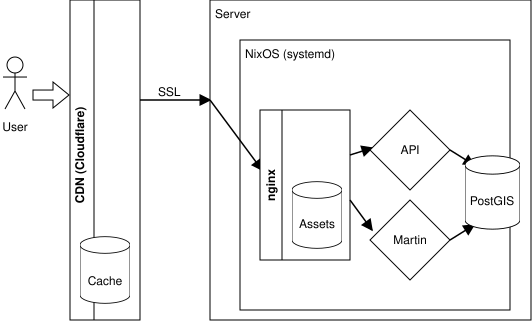

# Deployment

The OpenRailwayMap is deployed on a NixOS server to provide a database with OpenStreetMap data, render tiles using Martin and serve the tiles and static assets using an Nginx proxy.

`flake.nix` packages every service as a plain program and provides a NixOS module, `services.openrailwaymap`, that runs the whole stack as ordinary NixOS services: the stock `services.postgresql` (with PostGIS) and `services.nginx`, plus systemd units for the import, Martin and the API, and a timer for the daily OSM data update. Everything generated from `features/*.yaml` (the osm2pgsql Lua tag tables, the signal and operator SQL, the MapLibre style, legend, taginfo, the JOSM preset and the API feature catalogue) is built by Nix as `.#generated`.

## Requirements

- A server running NixOS, with root SSH access.

## Diagram



## Data import

An initial import of OSM data is required. After the initial data import, the daily update will ensure the data is kept up to date.

The first boot of the server performs the import automatically (`openrailwaymap-import.service`): it downloads the OSM data file configured with `services.openrailwaymap.osmDownloadUrl` to `/var/lib/openrailwaymap/data.osm.pbf`, filters it and imports it into the database. A regional extract from https://download.geofabrik.de/ imports in minutes; the planet file is around 90GB and the filtering process takes time and a few GB of memory.

Follow the import:
```shell
journalctl -fu openrailwaymap-import
```

To redo the import from scratch, for example after switching to a different data file:
```shell
rm /var/lib/openrailwaymap/.imported /var/lib/openrailwaymap/data.osm.pbf
rm -r /var/lib/openrailwaymap/filtered
systemctl start openrailwaymap-import.service
```

## Setup

### Deploying the production configuration

`nixosConfigurations.production` (`nix/production.nix`) is the server that runs
https://openrailwaymap.app. To deploy exactly that, from a checkout of this
repository:
```shell
nixos-rebuild switch --flake .#production --target-host root@<server>
```

`nix/production.nix` carries the service settings (public host name, data
file, firewall) and the SSH keys; the disk and boot loader settings come from
`nix/image.nix` and must match the actual machine (replace them with the
`hardware-configuration.nix` that `nixos-generate-config` produces on it).
`.github/workflows/deploy.yml` runs the same command after the tests pass on
`master`, using the `DEPLOY_HOST` and `DEPLOY_SSH_KEY` secrets.

### Using the module in your own configuration

To run the OpenRailwayMap on a NixOS host you configure yourself, add this
repository to the host's flake inputs and import the NixOS module:
```nix
{
  inputs.openrailwaymap.url = "github:hiddewie/OpenRailwayMap-vector";

  outputs = { nixpkgs, openrailwaymap, ... }: {
    nixosConfigurations.railmap = nixpkgs.lib.nixosSystem {
      system = "x86_64-linux";
      modules = [
        openrailwaymap.nixosModules.default
        ./configuration.nix
      ];
    };
  };
}
```

Then enable the service in `configuration.nix`:
```nix
{
  services.openrailwaymap = {
    enable = true;
    osmDownloadUrl = "https://download.geofabrik.de/north-america/us/new-york-latest.osm.pbf";
    serverName = "openrailwaymap.app";
    publicHost = "openrailwaymap.app";
    publicProtocol = "https";
  };
}
```

This configures:

- `postgresql.service` with PostGIS and the schema from `db/`, tuned as `db/tune-postgis.sh` did (override with `services.postgresql.settings` and `lib.mkForce`).
- `openrailwaymap-import.service`, the data import above.
- `openrailwaymap-martin.service` and `openrailwaymap-api.service`, on local ports 3001 and 5002 (`martinPort`, `apiPort`).
- `nginx.service` serving the site, tiles and API on port 8000 (`port`), with the production cache settings (`nginxCacheTtl`, `clientCacheTtl`).
- `openrailwaymap-update.timer`, the daily update below.

See `nix/module.nix` for all options.

Deploy:
```shell
nixos-rebuild switch --flake .#railmap --target-host root@<server>
```

### SSL

The service serves plain HTTP. Ensure TLS is terminated in front of it, either by the CDN (see Cloudflare below) or by nginx itself:
```nix
{
  services.nginx.virtualHosts."openrailwaymap.app" = {
    enableACME = true;
    forceSSL = true;
    locations."/".proxyPass = "http://127.0.0.1:8000";
  };
  security.acme = {
    acceptTerms = true;
    defaults.email = "admin@example.org";
  };
}
```

### Daily update

The daily update timer and service are installed by the module: `openrailwaymap-update.timer` runs `openrailwaymap-update.service` every day at 08:00 (`services.openrailwaymap.update.onCalendar`). It applies the OSM replication diffs to the data file, re-imports it and restarts Martin and the API. Disable it with `services.openrailwaymap.update.enable = false`.

Verify the timer is installed:
```shell
systemctl list-timers --all
```

Verify the timer works as intended:
```shell
systemctl start openrailwaymap-update.service
```

### Updating the software

Update the flake input and deploy again:
```shell
nix flake update openrailwaymap
nixos-rebuild switch --flake .#railmap --target-host root@<server>
```

The generated files are rebuilt by Nix; the database keeps its data. After changes to `features/` or `import/sql`, refresh the database functions and views:
```shell
sudo -u openrailwaymap env ORM_DATA=/var/lib/openrailwaymap PGHOST=/run/postgresql orm-import refresh
```

### Images

`nix/example-host.nix` is a minimal host of this kind. Build a bootable image of it with
```shell
nix build .#nixosConfigurations.image.config.system.build.images.qemu-efi
```
and the other `system.build.images.*` variants (`raw-efi`, `amazon`, `digital-ocean`, `lxc`, `proxmox`, ...). Root's initial password is `openrailwaymap`; change it or add SSH keys in a real deployment.

## Cloudflare

Configure Cloudflare to point to the IPv6 address of the server.

## Ready!

The OpenRailwayMap is now available on https://openrailwaymap.app.

# Development

The same example host as an imperative NixOS container on the local machine. This needs `boot.enableContainers = true;` in the host's NixOS configuration (it provides the `nixos-container` command); then:
```shell
sudo nixos-container create orm --flake .#container
sudo nixos-container start orm
sudo nixos-container show-ip orm   # then open http://<ip>:8000
```

After changing anything, `sudo nixos-container update orm --flake .#container`. Logs: `sudo nixos-container run orm -- journalctl -fu openrailwaymap-import`.

On a Linux distribution other than NixOS (with systemd and Nix installed) the same configuration runs directly under `systemd-nspawn`, sharing the host's Nix store:
```shell
sudo nix run .#nixosConfigurations.container.config.system.build.nspawn
```
The container's root filesystem is created in `./nixos-root` in the current directory. The host gets a bridge `br1` at 192.168.1.254 and the container is 192.168.1.1, so the site is http://192.168.1.1:8000 from the host. The container has no route to the internet by default, so either NAT `br1` on the host or point `services.openrailwaymap.osmFile` at a local extract instead of `osmDownloadUrl`.

The pieces can also be run by hand against any PostgreSQL that has PostGIS, hstore and unaccent and the schema from `db/*.sql`:
```shell
nix develop                              # psql, osmium, osm2pgsql, hurl and:
ORM_DATA=./data orm-import import        # also: update, refresh, filter (as import/import.sh)
DATABASE_URL=postgresql://... orm-martin # tiles on 127.0.0.1:3001 (MARTIN_LISTEN)
POSTGRES_HOST=... orm-api                # API on 127.0.0.1:5002 (HOST, PORT)
```

`nix fmt` formats the Nix files (treefmt with nixfmt, nothing else). `nix flake check` runs the import unit tests, the feature schema validation, the formatting check and a NixOS container test that imports a Berlin extract and runs the API and proxy test suites against the running services; `.github/workflows/test.yml` runs the same.

The container test runs the stack in a systemd-nspawn container inside the build sandbox, which needs Nix's user-namespace support. On NixOS enable it with
```nix
{
  nix.settings = {
    experimental-features = [ "nix-command" "flakes" "auto-allocate-uids" "cgroups" ];
    auto-allocate-uids = true;
    use-cgroups = true;
    system-features = [ "nixos-test" "benchmark" "big-parallel" "kvm" "uid-range" ];
  };
}
```
or put the same settings in `/etc/nix/nix.conf` (`experimental-features = ...`, `auto-allocate-uids = true`, `use-cgroups = true`, `system-features = ... uid-range`) and restart the Nix daemon. Without `uid-range` Nix refuses to build the check (`required system features ... uid-range`).

## Differences from the containers

- The proxy's TLS listeners are dropped and `X-Rewrite-URL` is sent as `$request_uri` (NixOS lints nginx configs and rejects `$uri` there).
- The API runs under `uvicorn` directly rather than `fastapi run`, and reads `WIKIDATA_BASE_URL` (default `https://www.wikidata.org`) for its Wikidata/Wikimedia requests; the VM test points it at recorded responses in `nix/test/wikidata` (refresh them with `nix/test/wikidata/update.sh`).
- The npm dependencies of the generator scripts (`yaml`, `chroma-js`) are pinned in `nix/node-deps/package-lock.json`; bump the versions there when the generator scripts change them.
